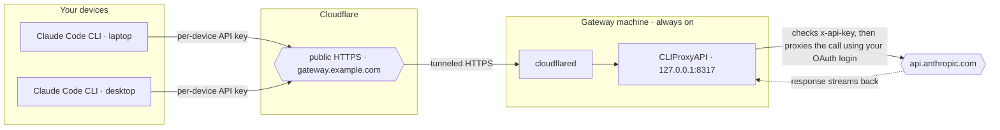

# claude-gateway-installer

One-shot, **CLI-only** installer that turns any **Linux** or **macOS** machine
into a Claude Code Gateway: run the Claude Code CLI on all your own devices,
authenticated by a single Claude subscription, over public HTTPS.

It checks your machine **before downloading anything**, detects your OS and
CPU architecture, downloads the correct native CLIProxyAPI build (no Docker
needed), and walks you through the few remaining steps — Claude login
(paste-back, works headless), Cloudflare Tunnel, and starting the service.
Everything runs from the terminal; no browser on the gateway machine required.

```bash
cd claude-gateway-installer
bash install.sh
```

## How the pieces work together



1. Each of your devices runs Claude Code pointed at `gateway.example.com`
   (`ANTHROPIC_BASE_URL`) with its own 256-bit key (`ANTHROPIC_AUTH_TOKEN`).
2. Cloudflare Tunnel (`cloudflared`) delivers the request to the gateway
   process on `127.0.0.1:8317`.
3. CLIProxyAPI checks the per-device key, then forwards the call to
   `api.anthropic.com` signed with your Claude subscription login.
4. The response streams back the same way — files never leave the device.

## What you need beforehand

| Requirement | Notes |
|---|---|
| A machine that stays on | Linux with systemd, or macOS |
| A domain on Cloudflare | e.g. `example.com` — used for `claude-gateway.example.com` |
| A Claude subscription | Any Claude plan with API access (the gateway calls the API as your own account) |
| `sudo` | Only for installing the system service / cloudflared |

## Step 1 — machine check (no downloads)

Before anything is downloaded the installer verifies:

- OS / CPU architecture (supported: `linux_amd64`, `linux_aarch64`,
  `darwin_amd64`, `darwin_aarch64`)
- required commands (`bash`, `curl`, `openssl`, `tar`)
- network reachability of `github.com`
- the service manager (`systemd` on Linux, `launchctl` on macOS)
- that the gateway port (default `8317`) is free — if another process occupies
  it, you can choose to kill it and continue, or abort
- `sudo` availability, and whether `cloudflared` is already installed

If something is missing, it tells you **before** downloading a single byte.

## Steps 2–6

1. **Download** the correct native CLIProxyAPI build for your OS/arch.
2. **Keys + config** — generates one random 256-bit API key per device you
   name (e.g. `laptop,work-desktop,macbook`) and writes `config.yaml`.
3. **Claude login** — CLI paste-back flow:
   - the installer prints an `https://claude.ai/oauth/authorize?...` URL;
   - open it in **any** browser (your laptop, phone, wherever), sign in with
     your Claude subscription account and click Authorize;
   - the browser redirects to `http://localhost:54545/callback?code=...`
     (the page fails to load — expected);
   - copy the FULL callback URL and paste it back here. No tmux needed.
4. **Cloudflare Tunnel** — detects whether `cloudflared` is installed and
   whether a tunnel is already running, then offers:
   - **1 · existing tunnel** — just add the public hostname in the dashboard;
   - **B · new tunnel from a dashboard token** — recommended; works on any
     machine (incl. headless); `cloudflared` auto-installs and registers
     itself as a background service;
   - **s · skip** — you handle the tunnel yourself.
5. **Start the gateway** — installs it as a background service
   (Linux → systemd `cliproxyapi.service`; macOS → a LaunchAgent),
   health-checks `127.0.0.1:8317` and the public URL, then prints the exact
   env vars for each of your devices.

## After installation — on each client device

```bash
npm install -g @anthropic-ai/claude-code

export ANTHROPIC_BASE_URL="https://claude-gateway.example.com"
export ANTHROPIC_AUTH_TOKEN="<your-per-device-key>"
unset ANTHROPIC_API_KEY
```

The keys were printed at the end of the installer and saved in
`~/claude-gateway/secrets/keys.txt`.

## Day-2 commands

```bash
./gateway.sh status       # is it running?
./gateway.sh logs tail    # follow the logs (journalctl on Linux)
./gateway.sh restart
./claude-login.sh         # re-login when the OAuth token expires (~60–90 days)
```

## Re-running / notes

- The installer is **idempotent**: re-run it and it reuses an existing
  binary, keys, and `config.yaml` (and honours the port in that config).
- Keys live in `~/claude-gateway/secrets/keys.txt` and are embedded in
  `~/claude-gateway/cliproxyapi/config.yaml`. To revoke a device, remove its
  key from `api-keys:` in `config.yaml` (CLIProxyAPI reloads it automatically).
- If `claude-gateway.example.com` returns `401`, the gateway is fine — the OAuth
  token expired. Run `./claude-login.sh` and restart the service.

## Files

```
claude-gateway-installer/
├── install.sh              # one-shot interactive installer
├── claude-login.sh         # Claude OAuth login (CLI paste-back)
├── setup-tunnel.sh         # Cloudflare Tunnel detection + setup
├── gateway.sh              # status | start | stop | restart | logs
├── lib/
│   ├── common.sh           # shared helpers (OS/arch detection, prompts)
│   └── install-service.sh  # systemd / LaunchAgent service install
└── docs/th/installer.md    # Thai version of this README
```