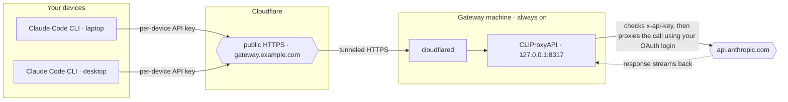

# claude-gateway-installer

One-shot, **CLI-only** installer that turns any **Linux** or **macOS** machine
into a Claude Code Gateway: run the Claude Code CLI on all your own devices,
authenticated by a single Claude subscription, over public HTTPS.

It checks your machine **before downloading anything**, detects your OS and
CPU architecture, downloads the correct native CLIProxyAPI build (no Docker
needed), and walks you through the few remaining steps — Claude login
(paste-back, works headless), Cloudflare Tunnel, and starting the service.
Everything runs from the terminal; no browser on the gateway machine required.

```bash
cd claude-gateway-installer
bash install.sh
```

The repo contains a **single entry point** — `install.sh`. Everything else
lives in `lib/`. Once you pick an install directory, the installer copies the
small management scripts (`gateway.sh`, `claude-login.sh`, `lib/common.sh`)
into that directory, so **all day-2 management happens from the install
directory** (default `~/claude-gateway`), never from this repo.

## How the pieces work together



1. Each of your devices runs Claude Code pointed at `gateway.example.com`
   (`ANTHROPIC_BASE_URL`) with its own 256-bit key (`ANTHROPIC_AUTH_TOKEN`).
2. Cloudflare Tunnel (`cloudflared`) delivers the request to the gateway
   process on `127.0.0.1:8317`.
3. CLIProxyAPI checks the per-device key, then forwards the call to
   `api.anthropic.com` signed with your Claude subscription login.
4. The response streams back the same way — files never leave the device.

## What you need beforehand

| Requirement | Notes |
|---|---|
| A machine that stays on | Linux with systemd, or macOS |
| A domain on Cloudflare | e.g. `example.com` — used for `claude-gateway.example.com` |
| A Claude subscription | Any Claude plan with API access (the gateway calls the API as your own account) |
| `sudo` | Only for installing the system service / cloudflared |

## Step 1 — machine check (no downloads)

Before anything is downloaded the installer verifies:

- OS / CPU architecture (supported: `linux_amd64`, `linux_aarch64`,
  `darwin_amd64`, `darwin_aarch64`)
- required commands (`bash`, `curl`, `openssl`, `tar`)
- network reachability of `github.com`
- the service manager (`systemd` on Linux, `launchctl` on macOS)
- that the gateway port (default `8317`) is free — if another process occupies
  it, you can choose to kill it and continue, or abort
- `sudo` availability, and whether `cloudflared` is already installed

If something is missing, it tells you **before** downloading a single byte.

## Steps 2–6

2. **Download** the correct native CLIProxyAPI build for your OS/arch.
3. **Keys + config** — generates one random 256-bit API key per device you
   name (e.g. `laptop,work-desktop,macbook`) and writes `config.yaml`.
4. **Claude login** — CLI paste-back flow:
   - the installer prints an `https://claude.ai/oauth/authorize?...` URL;
   - open it in **any** browser (your laptop, phone, wherever), sign in with
     your Claude subscription account and click Authorize;
   - the browser redirects to `http://localhost:54545/callback?code=...&state=...`
     (the page fails to load — expected);
   - copy the FULL callback URL (it must include both `code` and `state`)
     and paste it back here. No tmux needed.
5. **Cloudflare Tunnel** — detects whether `cloudflared` is installed and
   whether a tunnel is already running, then lets you choose:
   - **Use existing tunnel** — shows the tunnel id + hostnames it already
     serves right away; then, for a config-file-managed tunnel, offers to add
     your new hostname → `localhost:<port>` to the config and restart it
     (sudo — you type the password). The public URL is asked **after** this
     choice, so it fits the tunnel you picked.
   - **Create a new tunnel** — paste a dashboard token; works on any machine
     (incl. headless) and needs **no local cloudflared login** — the token
     carries the tunnel + credentials. `cloudflared` auto-installs and
     registers itself as a background service.
   - **Skip** — you handle the tunnel / VPN yourself.
6. **Start the gateway** — installs it as a background service
   (Linux → systemd `cliproxyapi.service`; macOS → a LaunchAgent),
   health-checks `127.0.0.1:8317` and the public URL, then prints the exact
   env vars for each of your devices.

## After installation — on each client device

```bash
npm install -g @anthropic-ai/claude-code

export ANTHROPIC_BASE_URL="https://claude-gateway.example.com"
export ANTHROPIC_AUTH_TOKEN="<your-per-device-key>"
unset ANTHROPIC_API_KEY
```

The keys were printed at the end of the installer and saved in
`~/claude-gateway/secrets/keys.txt`.

## Day-2 commands

All commands below run **from the install directory** (default
`~/claude-gateway`), where the installer copied the management scripts:

```bash
~/claude-gateway/gateway.sh list          # list all installed gateways (port, running, keys, oauth)
~/claude-gateway/gateway.sh status        # is it running?
~/claude-gateway/gateway.sh logs tail     # follow the logs (journalctl on Linux)
~/claude-gateway/gateway.sh restart
~/claude-gateway/gateway.sh uninstall     # stop + remove this instance's service, optionally delete
                                          # its dir, and offer to drop its hostname from the tunnel
~/claude-gateway/gateway.sh uninstall <dir>   # uninstall a specific instance by path
~/claude-gateway/claude-login.sh          # re-login when the OAuth token expires (~60–90 days)
```

(If you installed elsewhere, replace `~/claude-gateway` with your install dir.)

## Re-login

The Claude OAuth token the gateway uses expires roughly every **60–90 days**.
You will know when it has: your devices get `401` from the gateway even though
the gateway itself is running and healthy.

To re-login, on the **gateway machine** run the copied script from the install
directory:

```bash
~/claude-gateway/claude-login.sh
```

It repeats the paste-back flow:

1. Open the printed `https://claude.ai/oauth/authorize?...` URL in any browser
   and sign in with your Claude subscription account → Authorize.
2. The browser redirects to a `localhost` URL (page fails to load — expected).
3. Copy the **FULL** callback URL — it must include both `code` and `state`,
   e.g. `http://localhost:54545/callback?code=xxxxx&state=yyyyy` — and paste
   it back into the terminal.
4. When it says authentication successful, restart the gateway:

```bash
~/claude-gateway/gateway.sh restart
```

Then verify on a client device: `claude` should work again.

## Re-running / notes

- The installer is **idempotent**: re-run it and it reuses an existing
  binary, keys, and `config.yaml` (and honours the port in that config).
- **Multiple gateways** can run side by side: each install dir gets its own
  service identity (macOS label / systemd unit name derived from the dir name,
  e.g. `~/claude-gateway-second` → `com.claude-gateway.cliproxyapi.claude-gateway-second`).
  `gateway.sh` run from inside an install dir (or with `INSTALL_DIR=<dir>`)
  targets that instance only, and `gateway.sh uninstall` removes only that
  instance's service + directory. The default `~/claude-gateway` keeps the
  original `com.claude-gateway.cliproxyapi` / `cliproxyapi.service` names.
- Keys live in `~/claude-gateway/secrets/keys.txt` and are embedded in
  `~/claude-gateway/cliproxyapi/config.yaml`. To revoke a device, remove its
  key from `api-keys:` in `config.yaml` (CLIProxyAPI reloads it automatically).
- If `claude-gateway.example.com` returns `401`, the gateway is fine — the OAuth
  token expired. Follow the [Re-login](#re-login) section above.

## Tests

The pure logic in `lib/common.sh` (service naming, paste-back callback
validation, the cloudflared ingress add/remove transforms) has a small
zero-dependency test harness — no framework to install:

```bash
bash tests/run.sh
```

The tests `source` `lib/common.sh` and assert on function output only — no
`sudo`, no network, no real install. If you refactor a helper, run this.

## Files

```
claude-gateway-installer/
├── install.sh              # one-shot interactive installer (the only file you run)
├── lib/
│   ├── setup-tunnel.sh     # Cloudflare Tunnel detection + setup (run by install.sh)
│   ├── claude-login.sh     # Claude OAuth login (CLI paste-back) — copied to install dir
│   ├── gateway.sh          # status | start | stop | restart | logs | uninstall | list — copied to install dir
│   ├── common.sh           # shared helpers (OS/arch detection, prompts) — copied to install dir
│   └── install-service.sh  # systemd / LaunchAgent service install
├── tests/
│   └── run.sh              # zero-dependency unit tests (bash tests/run.sh)
└── docs/th/installer.md    # Thai version of this README
```

After an install, your chosen directory contains the working copies you
actually use:

```
~/claude-gateway/
├── gateway.sh              # status | start | stop | restart | logs | uninstall | list
├── claude-login.sh         # re-login when the OAuth token expires
├── lib/common.sh           # shared helpers (do not edit)
├── cliproxyapi/            # gateway binary + config.yaml + auth/ (OAuth token)
└── secrets/keys.txt        # your per-device API keys
```